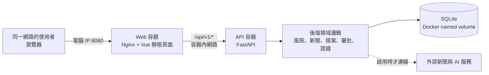
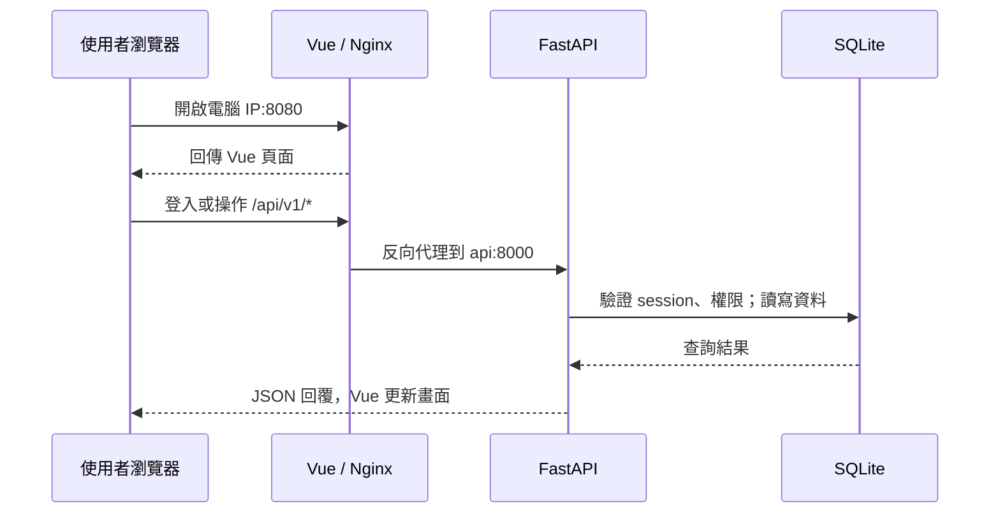

# 系統架構與流程說明（會議版）

## 一句話介紹

這套系統把供應商、採購單、庫存及風險事件放在同一個工作台：先看出哪裡可能受影響，再讓人員審查情報、提出替代方案，最後由有權限的人核准。它目前是使用合成資料的展示環境，舊版 Streamlit 網站不在此專案內。

## 一、整體架構

| 元件 | 做什麼 | 為什麼這樣分 |
| --- | --- | --- |
| Vue 前端，`frontend/` | 登入、地圖、情報審查、事件、What-if、提案與核准畫面 | 畫面可獨立設計和建置；風險判斷與權限不放在瀏覽器裡。 |
| Nginx，Web 容器 | 將 Vue 頁面送到瀏覽器，並把 `/api/` 轉送給 API 容器 | 使用者只需一個網址；瀏覽器以同一來源呼叫 API，也不用對區網公開 API 的 8000 埠。 |
| FastAPI，API 容器，`backend/api/` | 接 HTTP 請求、驗證登入與權限、回傳資料 | 前端與後端有清楚介面；後端規則可被測試及重用。 |
| 領域邏輯，`backend/backend/` | 計算風險、處理新聞、建立採購提案、審批與保存證據 | 規則集中在後端，不能只靠前端畫面限制操作。 |
| SQLite + Docker named volume | 存放 Demo 使用者、供應商、採購單、新聞、事件與操作紀錄 | 程式映像與資料分離；重建容器不會因容器刪除而清空資料。 |

Web 與 API 是兩個獨立容器，由 Docker Compose 建立同一個內部網路。只有 Web 的 8080 埠對執行電腦開放；API 的 8000 埠只供 Compose 網路內的 Web 使用。跨電腦觀看時，成員開啟 `http://<執行電腦的區網 IPv4>:8080`。區網防火牆須允許該埠。

## 二、啟動時怎麼跑

1. 在另一台電腦安裝並啟動 Docker Desktop，使用 Linux containers。從私人 Docker Hub 倉庫拉下 `launcher`、`web`、`api` 三個固定標籤的映像；`launcher` 只裝啟停檔及 Compose 設定，不是第四個常駐服務。另一種方式是從 GitHub 公開原始碼建置 Web 與 API。詳細指令見[根目錄 README](../README.md)。
2. Compose 建立 Web、API 容器，以及獨立的 named volume。Hub 模式與原始碼建置模式的 Compose 專案名稱、volume 各自分開。
3. API 啟動命令先執行 `api.meeting_seed`。它初始化 SQLite 結構並補上合成展示資料；既有資料會沿用，展示 fixture 避免重複建立。資料庫位於容器內 `/var/lib/erp/erp.db`，實際由 volume 保存，不要求 GitHub 有 `data/` 資料夾。
4. API 的 `/api/v1/ready` 檢查資料庫可讀；Compose 等 API 健康後再啟動 Web。啟動腳本最後透過 Web 網址再次檢查 API，並印出本機與區網網址。

**資料可攜性：**映像與原始碼帶的是程式及初始合成資料規則，不會帶走目前這台電腦的 SQLite 歷史。換電腦首次啟動是一份新的 Demo；若要保留既有操作紀錄，需另行備份及還原 named volume。一般 `docker compose down` 保留 volume；`down --volumes` 會刪除該模式的資料。

## 三、使用者操作時怎麼跑

登入時 API 驗證帳密，在資料庫建立 8 小時 session，瀏覽器保存 HttpOnly cookie。寫入操作還要送 CSRF token；API 依角色與組織權限再檢查一次。Demo 有 `viewer`（觀測）、`planner`（分析與提案）、`approver`（採購核准）三種帳號。這些是展示帳號，不應直接對公網提供服務。

## 四、供應鏈風險的業務流程

1. **L1 觀測：**後端從供應商所在地產生地圖據點，結合已確認風險事件、事件預估延遲、地區係數與採購集中度，顯示風險分數、理由、事件和採購曝險。分數是展示用規則指標，**不是事故機率預測**。前端以低於 45、45–69、70 以上區分顏色。
2. **情報與人工確認：**有權限的人可依正式供應商所在國家擷取新聞。若配置 AI，AI 會先分析關聯性與延遲天數；若沒有配置，新聞可保持待分析。分析結果只進入候選清單，**不會自動變成已確認風險事件**。規劃人員確認後建立事件，或附原因略過；來源、審查人與歷程留在資料庫。也可手動登錄事件。錯誤事件可附原因撤銷，撤銷後不再參與事件風險計算。
3. **What-if 與決策證據：**規劃人員輸入情境問題，API 擷取當下供應商、未結採購單和庫存的快照，再交給已配置的 AI 服務分析；回覆連同資料時間、快照及雜湊摘要保存，供人員覆核與回饋。沒有可用 AI 設定時，此功能會回報不可用，基本 Demo 仍可展示。啟用外部 AI 時，這些 ERP 情境資料可能送往所設定的服務。
4. **L2 替代採購提案：**根據受影響採購單與可用替代供應商，規劃人員選擇方案、填理由並送審。提案保存原採購脈絡和內容摘要；**送審本身不建立替代採購單**。
5. **L3 人工核准：**核准人查看提案證據與待審清單，核准或附原因拒絕。核准時 Gateway 再核對提案與待執行參數是否一致，才執行受控採購操作，並留下操作歷程。這一層是為了讓系統建議與真正改動 ERP 資料之間保有人員決策點。

風險地圖的預設分數從 20 起算，按匹配事件的延遲天數加權；多筆事件增加少量分數，超過 30 天的事件權重減半。地區係數與採購集中度可把分數抬高；有授權的人工或 AI 覆寫值則會顯示為覆寫結果。這個規則讓展示時能說明「分數從哪裡來」，但真實企業導入前應以其資料和風險準則重新校準。

## 五、為什麼選這個部署方式

- **前後端分離：**Vue 專注互動介面，FastAPI 掌管資料、規則與權限；淘汰 Streamlit 後，不再由同一個 Python 頁面兼做畫面和業務邏輯。
- **全部在 Docker 執行：**另一台電腦主要需要 Docker Desktop；Python、Node、Nginx 等執行環境隨映像提供，降低環境差異。Web、API 可分別重建。
- **Docker Hub 交付 + GitHub 留原始碼：**會議電腦可拉取已建好的固定標籤映像，省去現場建置；公開 GitHub 則保留可檢視、可修改、可自行建置的前後端原始碼。Hub 映像目前仍是私人倉庫，需要有權限的帳號登入。
- **資料放 volume：**程式更新和 Demo 資料的生命週期分開。原始碼與映像不包含本機資料庫，也不應包含 API 金鑰。
- **人工審查及分層權限：**AI 是輔助判讀；新聞確認、提案送審、採購核准各有明確責任與紀錄。

## 六、會議可直接說的版本（約 90 秒）

> 這次我們把舊的 Streamlit 畫面淘汰，改成 Vue 前端與 FastAPI 後端，兩者都在 Docker 裡面跑。使用者只要開會議電腦的網址，就會進到 Vue 工作台；所有資料操作會經由 Nginx 轉給 FastAPI，由後端做登入、權限和風險判斷。資料存放在 Docker volume，不在程式碼裡，所以換電腦第一次啟動會自動產生一份新的合成 Demo 資料。
>
> 業務流程分三層：L1 先從供應商據點、事件與採購資料看風險；外部新聞即使經過 AI 分析，也要先由人確認，才會形成正式風險事件。L2 根據受影響採購單提出替代供應商方案；L3 由核准人檢查證據後，才允許真正的採購操作。What-if 是輔助分析，會保留當時的資料快照，方便日後追查。
>
> 交付方式有兩個：開會直接登入 Docker Hub 拉已建好的映像；開發或查核則到公開 GitHub 看完整 Vue 和 FastAPI 原始碼。這樣既方便搬到另一台電腦展示，也保留清楚的修改與審查路徑。

## 七、目前邊界

- 本版是**單一展示組織、SQLite 與合成資料**。跨組織正式上線、備份還原、自動化部署、監控與生產級帳號管理，需要另行規劃。
- Docker Hub 映像的版本標籤為 `bd37ee0`；另一台 Windows 電腦須能執行 Docker Desktop 的 Linux containers 及 `docker compose`，並能存取 Hub。若主機 8080 埠被占用，可在 `.env` 調整 `ERP_WEB_PORT`。
- 區網展示已在 Compose 中開放 Web 埠，但另一台電腦的實際啟動、Windows 防火牆與第二台裝置連線，仍需現場驗收。
